# Topcoder Auth0 backup to Github automation

This lambda function downloads configuration from Auth0 and syncs them with the provided Github repository.

## Deployment guide

### Prerequisites

1. [Node.js 12.x](https://nodejs.org/en/download/)

2. [An AWS Account](https://aws.amazon.com/)

3. [Serverless](https://serverless.com/framework/docs/providers/aws/guide/installation/) - `npm install -g serverless`

### Setup

There are 4 components to setup before verification. They are,

1. Auth0
2. Github
3. AWS
4. Serverless

The steps to set them up are,

#### Auth0 Setup

1. Sign up to Auth0 by clicking on https://auth0.com/signup

2. Create a tenant. Select a region and click Next.

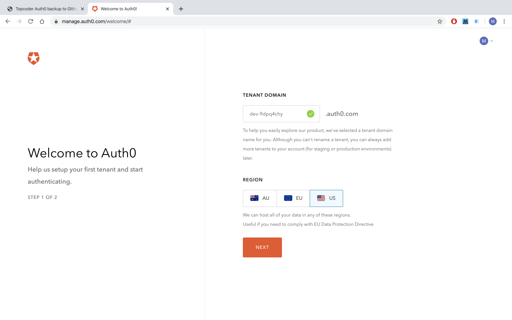

3. For Account type, choose, **Personal**

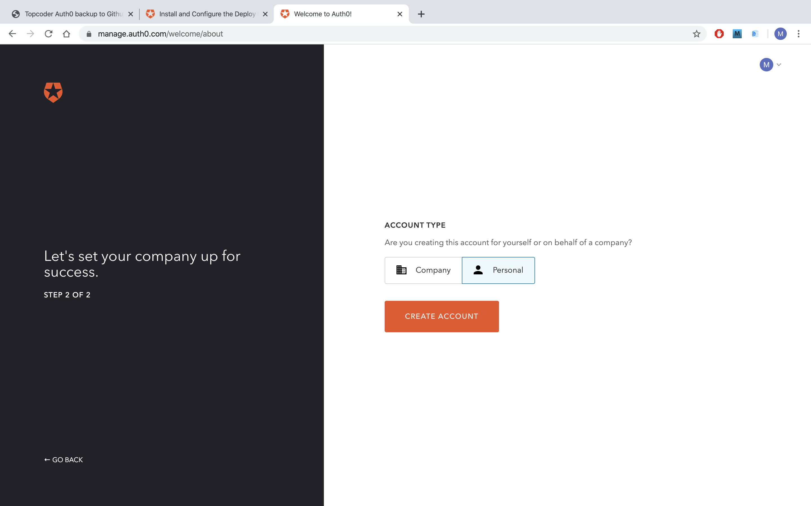

4. On the Auth0 dashboard, click Extensions and search for **cli**. Click on the extension, **Auth0 Deploy CLI**

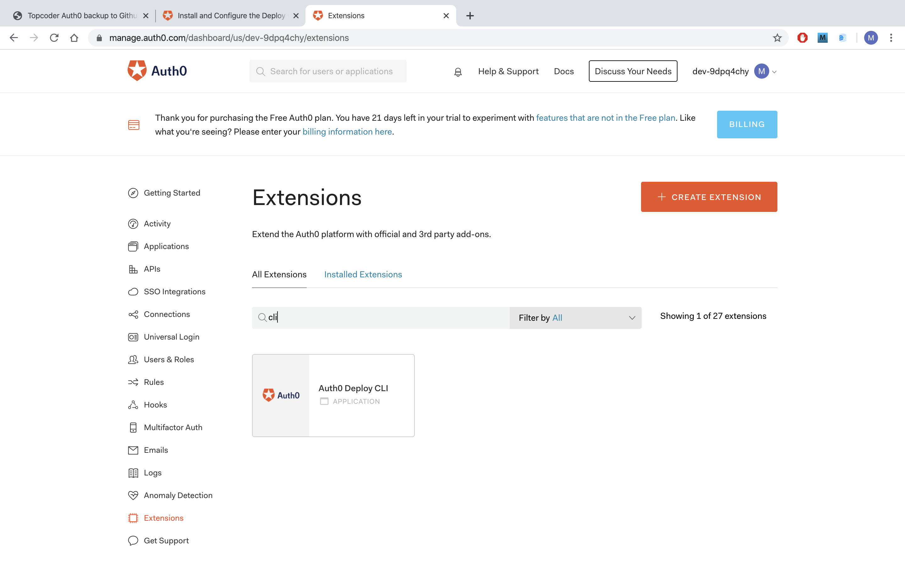

5. Install the extension

6. Accept the permissions

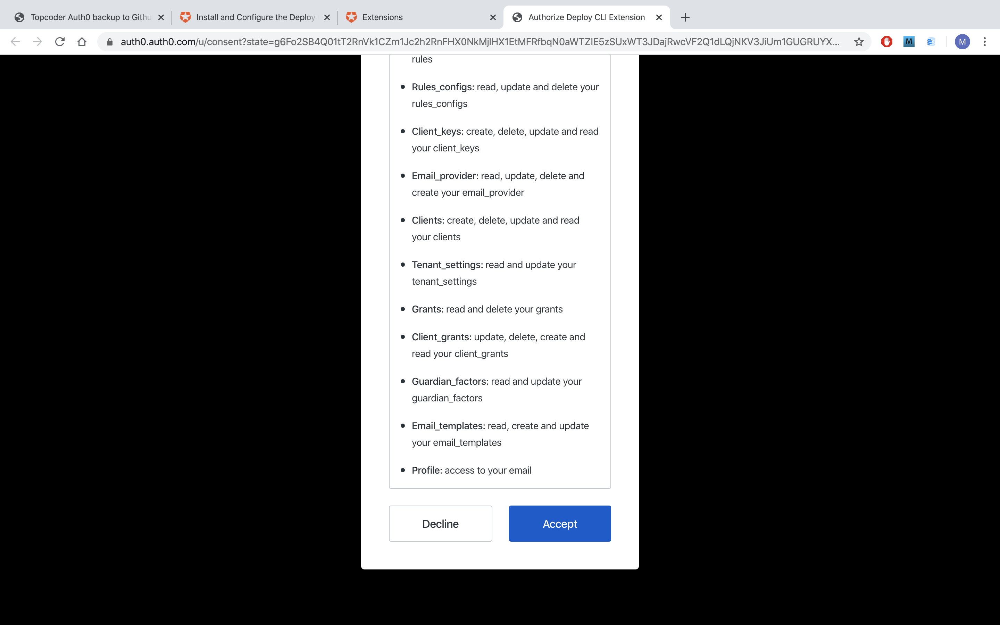

7. On the dashboard, click on Applications.

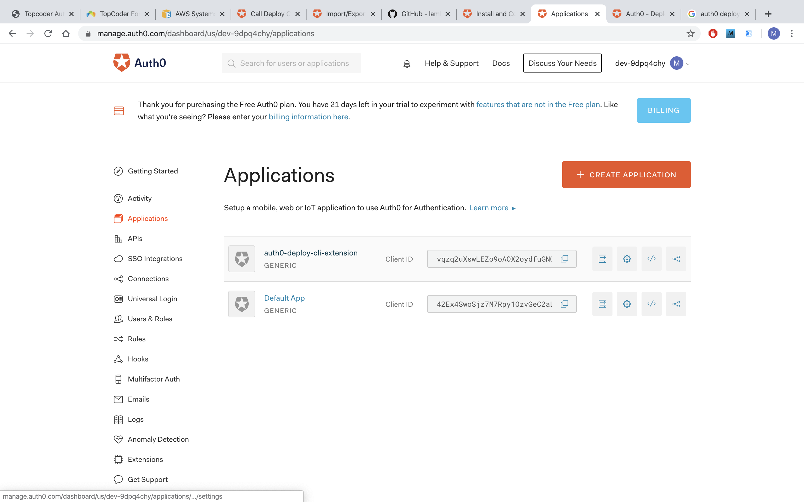

8. Select application, **auth0-deploy-cli-extension**. Go to the extension page and click on Settings. 

Copy the value of Domain and paste it's value to **AUTH0_DOMAIN** and in **AUTH0_KEYWORD_REPLACE_MAPPINGS** -> **AUTH0_TENANT_NAME** in serverless.yml.

Also note down the values for Client ID and Client secret. You will need them later when storing it in AWS Parameter Store.

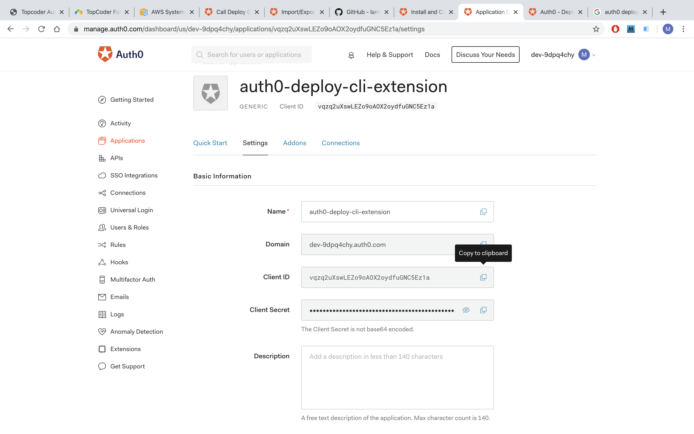

Alternatively, you can open https://auth0.com/docs/extensions/deploy-cli/guides/install-deploy-cli#configure-the-deploy-cli-tool, login, and see the config values automatically populated for application `auth0-deploy-cli-extension`.

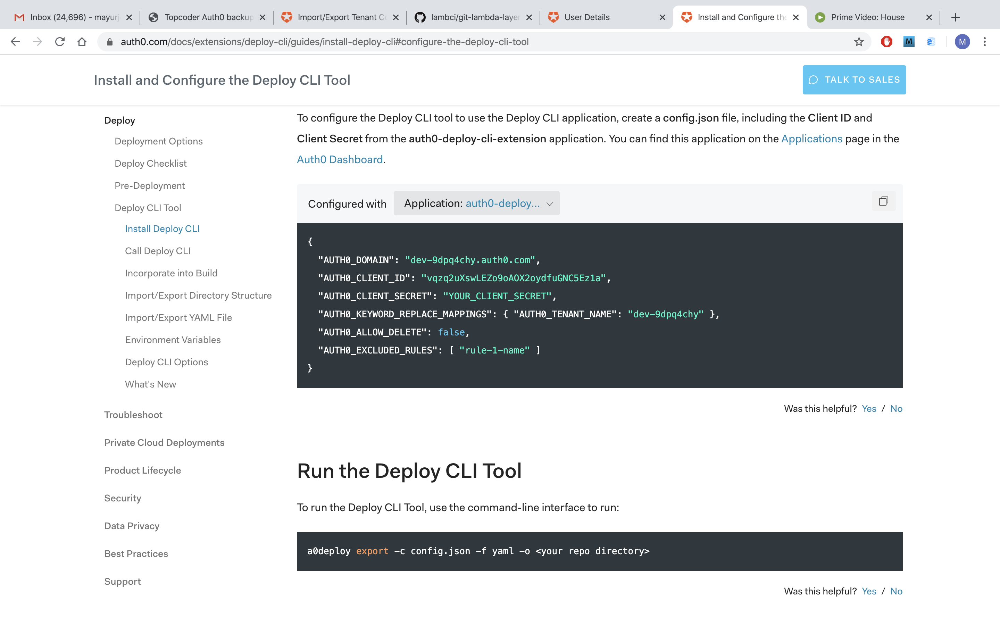

This completes the Auth0 setup.

#### Github setup

1. Create a new public repository. The requirements mention that, *You can assume the branch exists already in Github*. But a newly created repository has no branch. In order to create a branch, check **Initialize with readme**. This will create a master branch. 
  
    **NOTE**: The readme file will be overriden by the Auth0 config after the first run of the lambda function. This is because of the directory structure required by Auth0 as mentioned in https://auth0.com/docs/extensions/deploy-cli/guides/import-export-directory-structure#directory-structure-example. So the Auth0 config syncs to the entire repository.

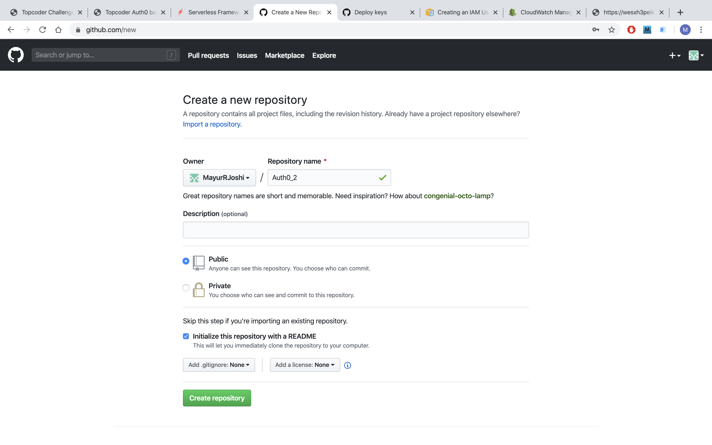

2. Once the repo is created, click on Settings -> Deploy keys -> Add new

3. You will most likely have an ssh key in your system. You can check how to access them for your OS by following, https://help.github.com/en/enterprise/2.15/user/articles/checking-for-existing-ssh-keys

If you do not have a public/private key pair, you can generate one by following https://help.github.com/en/enterprise/2.15/user/articles/generating-a-new-ssh-key-and-adding-it-to-the-ssh-agent#generating-a-new-ssh-key

You do **not** have to add it to the ssh-agent.

`ssh-keygen -t rsa -b 2048 -C "your_email@example.com"`

Using 4096 bits should work too.
Make sure to **NOT** have a passphrase to protect the keys.

Once done, you should have two keys generated, id_rsa (private key) and id_rsa.pub (public key).

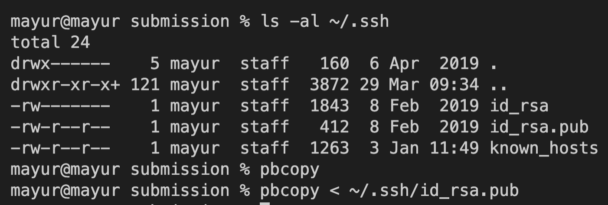

4. Copy the public key and paste it into the deploy keys box from step 2. **Check allow write access**.

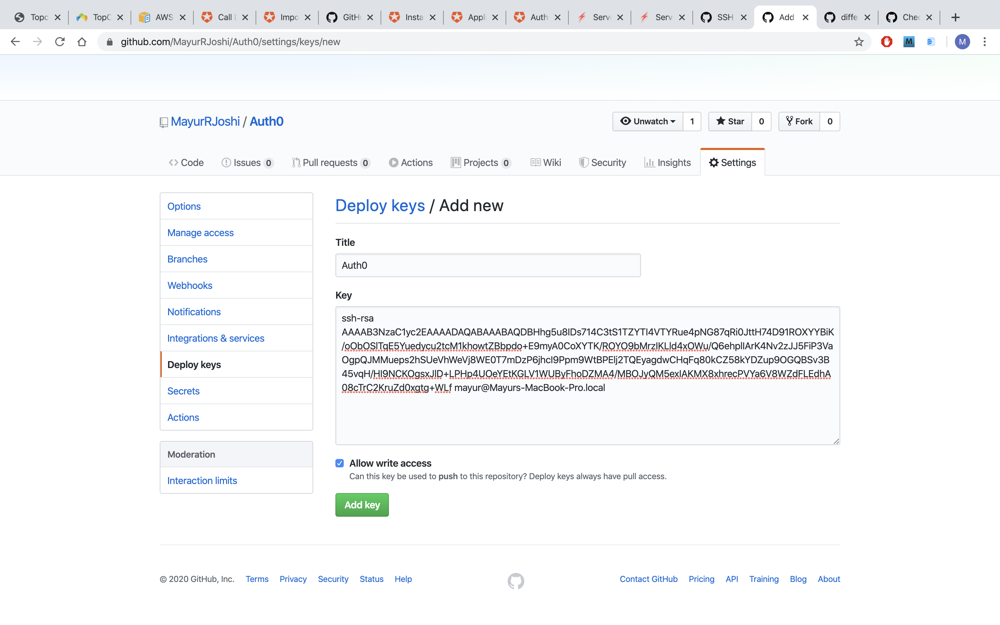

5. Update the **GITHUB_REPOSITORY_URL** and **GITHUB_REPOSITORY_BRANCH** values in serverless.yml with your values. Make sure the URL is an SSH url and the branch exists. 

Github setup is complete

#### AWS Setup

##### AWS credentials setup

If you haven't already, you need to create an IAM user in order to obtain an AWS_ACCESS_KEY_ID and an AWS_SECRET_ACCESS_KEY.

1. [Create an IAM user](https://docs.aws.amazon.com/IAM/latest/UserGuide/id_users_create.html) and then define that [user's permissions as narrowly as possible](https://docs.aws.amazon.com/IAM/latest/UserGuide/best-practices.html#grant-least-privilege). 

I simply created a user with admin access.

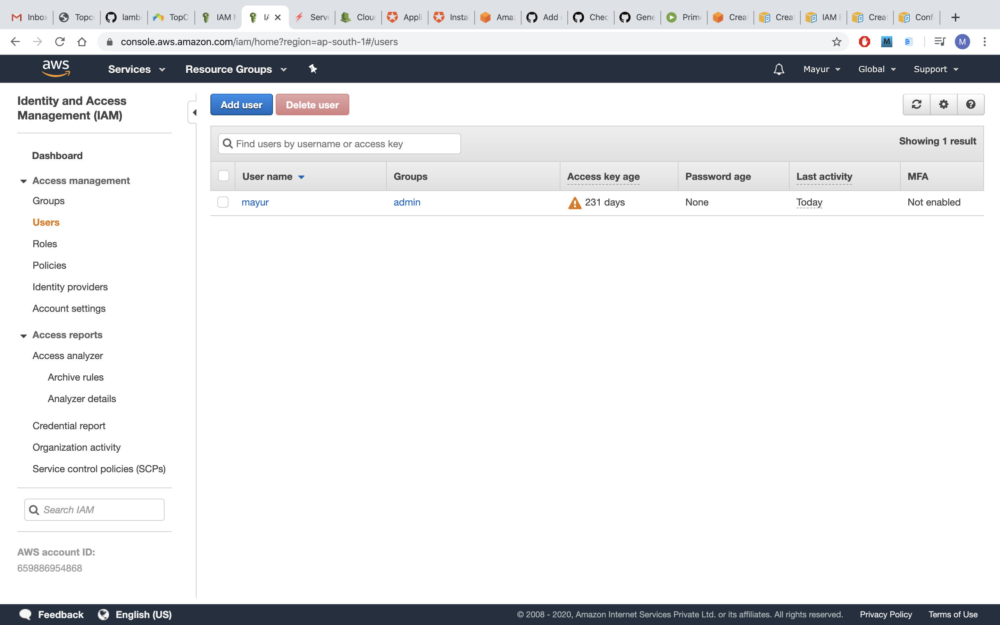

2. [Create the access key under that IAM user.](https://docs.aws.amazon.com/IAM/latest/UserGuide/id_credentials_access-keys.html#Using_CreateAccessKey)

In the downloaded csv file you will have both AWS_ACCESS_KEY_ID and AWS_SECRET_ACCESS_KEY

3. Download the AWS CLI https://aws.amazon.com/cli/

4. Run command `aws configure` and follow the instructions. At the end of the process, you should have a credentials file created at `~/.aws/credentials`

##### Parameter store setup

1. Go to your console, search for Service **AWS Systems Manager**

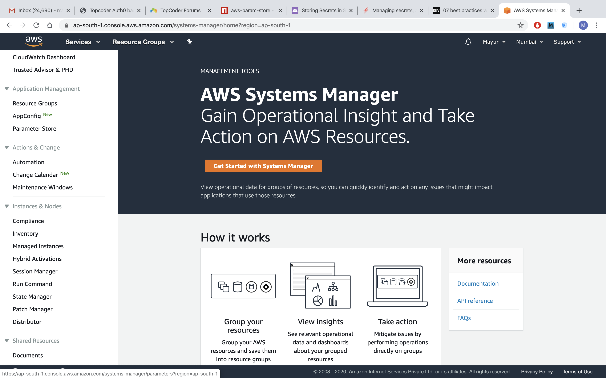

2. In the sidebar click **Parameter Store**

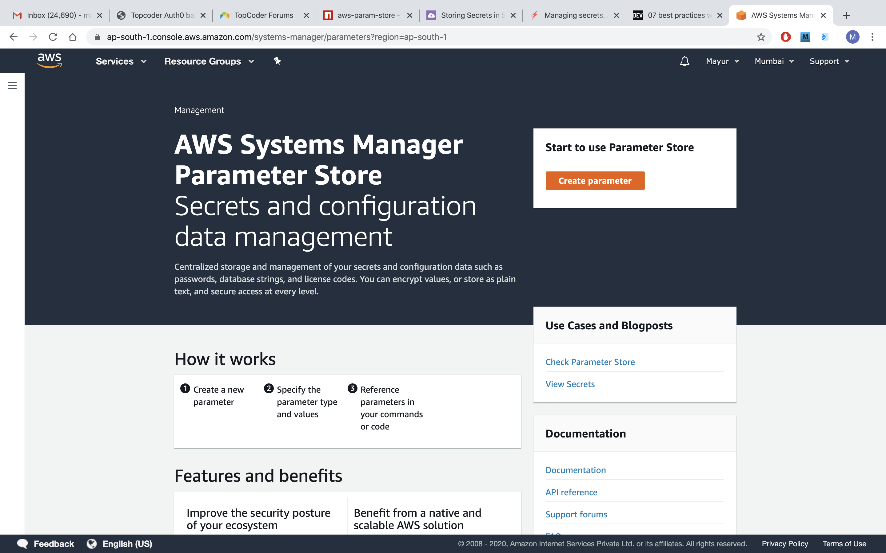

3. Click Create new parameter. You will now need to create 3 parameters with names, 
  1. **/dev/configbackup/github/private-key** for the private key created earlier

  2. **/dev/configbackup/auth0/client-id** for the Auth0 client id

  3. **/dev/configbackup/auth0/client-secret** for the Auth0 client secret

  The names of these parameters follow the AWS convention, **environment/application/service/parameter_name**

  If you need to change these names, then you will need to update them in **config/default.js** -> AWS_PARAMETER_STORE_CONFIGS -> dev

  To create these parameters, follow these steps,

  1. Enter name, description, select Standard, type as Secure String and choose KMS key source as My current account.

   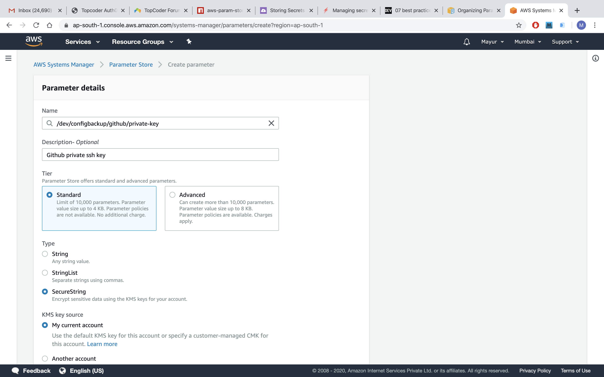

  2. Enter the value in the **Value** box and click **Create parameter**

   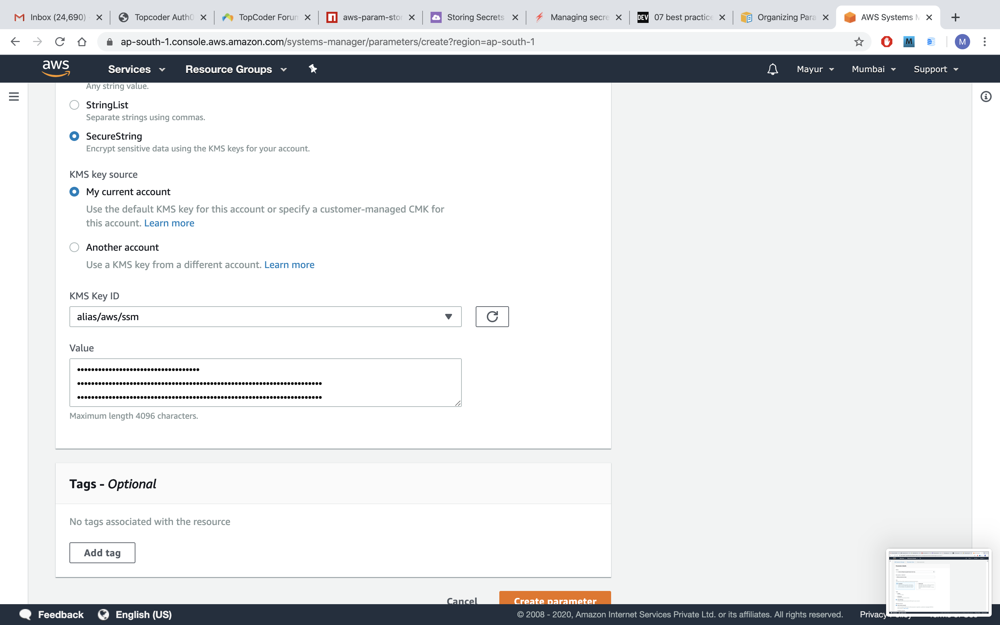

  3. Once done, you should have 3 parameters.

   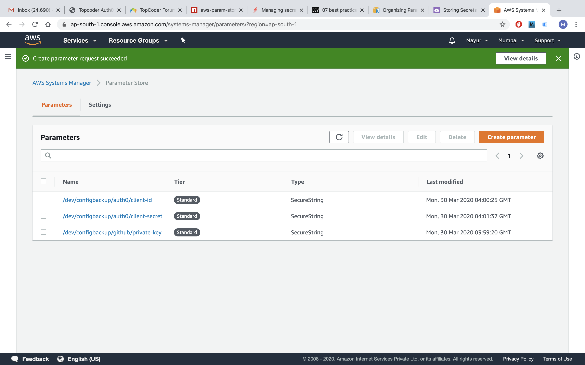

#### Serverless

1. Install required modules. `npm i`

2. Make sure to have the aws credential file setup by following the AWS setup above

3. Run `serverless deploy`. (If you need to change the AWS region before deploying, you can do so in serverless.yml -> provider -> region)

   

4. Go to AWS Console -> Lambda. You should see the **SyncAuth0ToGithub-dev-processor** function. Clicking it should reveal something like,

  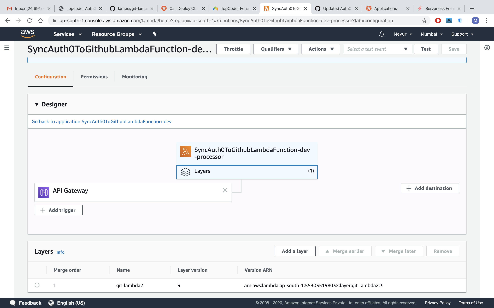

  Notice that git-lambda-layer is automatically setup as a layer and permissions to access parameter store are also setup.

  You can check the environment variables too.

This completes the deployment process. Now you can check [VerificationGuide.md](VerificationGuide.md) to verify the lambda function.

### Local setup

You can also test the function locally. Follow all the previous steps in Setup except the **Serverless setup** section.

Install node modules `npm i` and then you can run the lambda function locally using `serverless invoke local --function processor`.

[VerificationGuide.md](VerificationGuide.md) contains instructions about how to check for changes. You can follow the same approach but without the AWS related steps.

### Linter

1. `npm run lint` - Check lint errors

2. `npm run lint:fix` - Check and fix lint errors

### Other notes

1. To remove all services deployed to AWS you can run, `serverless remove`

2. The lambda function can run for upto 15min. However, requests to lambda go through API gateway. Gateway has a timeout of 30s.

  The fix to ensure lambda runs beyond 30s is to declare it **async**. And we need this as downloading Auth0 config may take longer.

  This means that a HTTP request triggers the lambda function and returns immediately with a status code 200.
  It does not wait for the process to complete.

3. You might see logs like "Could not create directory '/home/sbx_user1051/.ssh" in CloudWatch. This is expected as mentioned in https://github.com/lambci/git-lambda-layer#complex-example-on-nodejs-w-ssh 

"ssh always tries to create a .ssh directory – this is something you can't avoid, nor can you specify your own destination for this – which means you'll see a warning similar to the following:

Could not create directory '/home/sbx_user1075/.ssh'.
You can ignore this warning – ssh should continue to execute past this point, assuming you have the UserKnownHostsFile option correct and it contains the signature of the host you're trying to connect to. "

